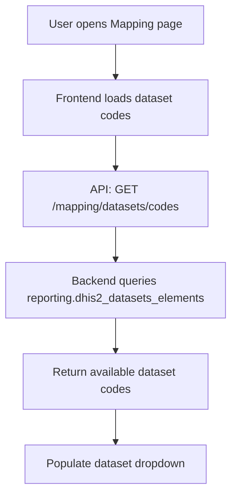
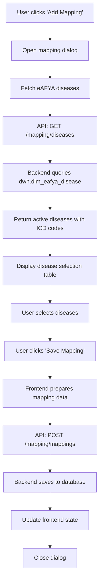

# eAFYA Mapping Implementation

This document provides a comprehensive guide to the eAFYA mapping functionality that allows users to map HMIS data elements to eAFYA disease items.

## 🎯 System Overview

The eAFYA mapping system is a comprehensive solution that enables healthcare administrators to create and manage mappings between HMIS (Health Management Information System) data elements and eAFYA disease items. This system facilitates data integration and reporting across different health information systems.

### 🏗️ Architecture Components

```
┌─────────────────┐    ┌─────────────────┐    ┌─────────────────┐
│   Frontend      │    │   Backend API   │    │   Database      │
│   (React)       │◄──►│   (Express.js)  │◄──►│   (PostgreSQL)  │
└─────────────────┘    └─────────────────┘    └─────────────────┘
```

- **Frontend**: React-based user interface for managing mappings
- **Backend**: RESTful API endpoints for CRUD operations
- **Database**: PostgreSQL database with dedicated mapping tables

## 📊 Database Schema

### Core Mapping Table

The `reporting.eafya_mappings` table stores all mapping relationships:

```sql
CREATE TABLE reporting.eafya_mappings (
  id BIGSERIAL PRIMARY KEY,                    -- Unique mapping record ID
  hmis_dataelement_code VARCHAR(255) NOT NULL, -- HMIS data element code (e.g., "105-CA01")
  hmis_dataelement_name VARCHAR(500) NOT NULL, -- Human-readable HMIS data element name
  dataelement_id VARCHAR(255),                 -- DHIS2 data element ID from source table
  dataset_code VARCHAR(50) NOT NULL,           -- HMIS dataset identifier (e.g., "HMIS1051")
  section_id VARCHAR(50),                      -- Section identifier within dataset (e.g., "1.3.11")
  eafya_item_id BIGINT NOT NULL,              -- eAFYA disease/item identifier
  eafya_item_name VARCHAR(500) NOT NULL,      -- eAFYA disease/item name
  created_at TIMESTAMP DEFAULT NOW(),          -- Creation timestamp
  updated_at TIMESTAMP DEFAULT NOW()           -- Last update timestamp
);
```

### Supporting Tables

- **`reporting.dhis2_datasets_elements`**: Source HMIS data elements (provides dataelement_id for mappings)
- **`dwh.dim_eafya_disease`**: eAFYA disease catalog

### Database Indexes

```sql
-- Performance optimization indexes
CREATE INDEX idx_eafya_mappings_dataelement ON reporting.eafya_mappings(hmis_dataelement_code);
CREATE INDEX idx_eafya_mappings_dataset ON reporting.eafya_mappings(dataset_code);
CREATE INDEX idx_eafya_mappings_item ON reporting.eafya_mappings(eafya_item_id);
```

## 🔄 System Flow & User Journey

### 1. Initial Setup & Data Loading



**What happens:**
- Component mounts and automatically fetches available dataset codes
- Backend queries the `reporting.dhis2_datasets_elements` table
- Frontend populates the dataset selection dropdown

### 2. Dataset & Section Selection

```mermaid
graph TD
    A[User selects dataset] --> B[Frontend fetches dataset elements]
    B --> C[API: GET /mapping/datasets/{code}/elements]
    C --> D[Backend returns all elements for dataset]
    D --> E[Frontend extracts unique section IDs]
    E --> F[Populate section dropdown]
    F --> G[User selects section]
    G --> H[Filter elements by section]
    H --> I[Display data elements table]
```

**What happens:**
- When user selects a dataset, frontend fetches all data elements for that dataset
- Backend queries elements and returns them with section information
- Frontend processes the data to extract unique sections and populate the section dropdown
- User selects a section, and frontend filters the data elements accordingly

### 3. Mapping Creation Process



**What happens:**
- User clicks "Add Mapping" button for a specific data element
- Frontend opens a modal dialog and fetches available eAFYA diseases
- Backend queries the disease catalog and returns active diseases with ICD codes
- User searches and selects diseases using checkboxes
- Frontend sends mapping data to backend API
- Backend uses database transactions to ensure data consistency
- Frontend updates its local state and closes the dialog

### 4. Mapping Retrieval & Display

```mermaid
graph TD
    A[Dataset selected] --> B[Fetch existing mappings]
    B --> C[API: GET /mapping/dataset/{code}/mappings]
    C --> D[Backend queries reporting.eafya_mappings]
    D --> E[Group mappings by data element]
    E --> F[Return grouped mappings]
    F --> G[Frontend displays existing mappings]
    G --> H[Show mapping tags with remove buttons]
```

**What happens:**
- When a dataset is selected, frontend automatically fetches existing mappings
- Backend queries the mappings table and groups results by data element code
- Frontend displays existing mappings as removable tags
- Each mapping shows the eAFYA item ID and name with a delete button

### 5. Mapping Deletion

```mermaid
graph TD
    A[User clicks remove button] --> B[Frontend calls delete API]
    B --> C[API: DELETE /mapping/{code}/{itemId}]
    C --> D[Backend removes from database]
    D --> E[Return success response]
    E --> F[Update frontend state]
    F --> G[Remove mapping tag from UI]
```

**What happens:**
- User clicks the trash icon on a mapping tag
- Frontend calls the delete API endpoint
- Backend removes the specific mapping from the database
- Frontend updates its local state and removes the tag from the UI

## 🛠️ API Endpoints Reference

### Core Mapping Operations

| Method | Endpoint | Description | Request Body | Response |
|--------|----------|-------------|--------------|----------|
| `GET` | `/mapping/datasets/codes` | Get available dataset codes | - | `["HMIS1051", "HMIS1052", ...]` |
| `GET` | `/mapping/datasets/{code}/elements` | Get data elements for dataset | - | Array of data elements |
| `GET` | `/mapping/diseases` | Get active eAFYA diseases | - | Array of diseases with ICD codes |
| `GET` | `/mapping/dataset/{code}/mappings` | Get all mappings for dataset | - | Grouped mappings by data element |
| `POST` | `/mapping/mappings` | Save new mappings | Mapping data object | Success message |
| `DELETE` | `/mapping/mappings/{code}/{itemId}` | Delete specific mapping | - | Success message |

### Detailed API Examples

#### Save Mappings
```http
POST /api/mapping/mappings
Content-Type: application/json

{
  "hmis_dataelement_code": "105-CA01",
  "hmis_dataelement_name": "Cervical Cancer Cases",
  "dataelement_id": "z07394519Gs",
  "dataset_code": "HMIS1051",
  "section_id": "1.3.11",
  "mappings": [
    {
      "id": 123,
      "name": "Cervical Cancer"
    },
    {
      "id": 124,
      "name": "Cervical Neoplasia"
    }
  ]
}
```

**Note**: The `dataelement_id` field is required and must contain the DHIS2 data element ID from the `reporting.dhis2_datasets_elements` table.

**Response:**
```json
{
  "message": "Mappings saved successfully",
  "count": 2
}
```

#### Get Dataset Mappings
```http
GET /api/mapping/dataset/HMIS1051/mappings
```

**Response:**
```json
{
  "105-CA01": [
    {
      "id": 123,
      "name": "Cervical Cancer",
      "dataelement_id": "z07394519Gs",

      "created_at": "2024-01-15T10:30:00Z",
      "updated_at": "2024-01-15T10:30:00Z"
    }
  ],
  "105-CA02": [
    {
      "id": 125,
      "name": "Breast Cancer",
      "dataelement_id": "z07394520Hs",

      "created_at": "2024-01-15T11:00:00Z",
      "updated_at": "2024-01-15T11:00:00Z"
    }
  ]
}
```

## 🎨 Frontend Components

### Main Components Structure

```
Mapping/
├── index.jsx                 # Main mapping page component
├── styles.css               # Component-specific styles
└── Components/
    └── MappingDialog.jsx    # Modal dialog for disease selection
```

### Key React Components

#### 1. **Mapping Component** (`index.jsx`)
- **Purpose**: Main container for the mapping interface
- **State Management**: Manages dataset selection, section selection, and current mappings
- **Key Functions**:
  - `fetchDatasetCodes()`: Loads available datasets
  - `fetchDatasetElements()`: Loads data elements for selected dataset
  - `fetchDatasetMappings()`: Loads existing mappings
  - `handleAddMapping()`: Opens mapping dialog
  - `handleSaveMapping()`: Saves new mappings via API
  - `handleRemoveMapping()`: Deletes mappings via API

#### 2. **MappingDialog Component**
- **Purpose**: Modal dialog for selecting eAFYA diseases
- **Features**:
  - Search functionality for diseases
  - Checkbox selection with select-all option
  - Displays disease ID, ICD code, and name
  - Responsive table layout

### State Management

```javascript
// Main component state
const [datasetCodes, setDatasetCodes] = useState([]);           // Available datasets
const [selectedDataset, setSelectedDataset] = useState('');     // Currently selected dataset
const [datasetElements, setDatasetElements] = useState([]);     // Data elements for dataset
const [selectedSection, setSelectedSection] = useState('');     // Currently selected section
const [currentMappings, setCurrentMappings] = useState({});     // Existing mappings
const [eafyaItems, setEafyaItems] = useState([]);              // Available eAFYA diseases
const [dialogState, setDialogState] = useState({...});          // Dialog state
const [loading, setLoading] = useState(false);                  // Loading states
```

## 🚀 Setup & Installation

### Prerequisites
- Node.js (v14 or higher)
- PostgreSQL database
- Access to eAFYA and HMIS data sources

### 1. Database Setup

Run the database setup script to create required tables:

```bash
cd backend
node scripts/addtables.js
```

This script will:
- Execute all SQL files in `sql/tablescripts/`
- Create the `reporting.eafya_mappings` table
- Set up necessary indexes for performance

### 2. Backend Setup

```bash
cd backend
npm install
npm start
```

The backend will:
- Start Express.js server
- Connect to PostgreSQL database
- Register mapping routes under `/api/mapping`

### 3. Frontend Setup

```bash
cd frontend
npm install
npm start
```

The frontend will:
- Start React development server
- Connect to backend API endpoints
- Provide mapping interface at `/mapping` route

## 🔍 Data Flow Examples

### Example 1: Creating a New Mapping

**User Action**: Maps "Malaria Cases" (HMIS1051) to eAFYA disease "Malaria"

**Data Flow**:
1. Frontend sends mapping data to `/api/mapping/mappings`
2. Backend validates input and starts database transaction
3. Backend deletes existing mappings for the data element
4. Backend inserts new mapping records
5. Backend commits transaction and returns success
6. Frontend updates local state and refreshes UI

**Database Result**:
```sql
INSERT INTO reporting.eafya_mappings (
  hmis_dataelement_code, hmis_dataelement_name, dataelement_id,
  dataset_code, section_id, eafya_item_id, eafya_item_name
) VALUES (
  '105-MA01', 'Malaria Cases', 'z07394521Is',
  'HMIS1051', '1.3.2', 123, 'Malaria'
);
```

### Example 2: Loading Existing Mappings

**User Action**: Selects HMIS1051 dataset

**Data Flow**:
1. Frontend calls `/api/mapping/dataset/HMIS1051/mappings`
2. Backend queries `reporting.eafya_mappings` table
3. Backend groups results by `hmis_dataelement_code`
4. Backend returns grouped mappings
5. Frontend updates state and displays mapping tags

## 🛡️ Error Handling & Validation

### Backend Validation

- **Required Fields**: Validates presence of `hmis_dataelement_code` and `mappings` array
- **Data Types**: Ensures mappings is an array
- **Database Constraints**: Handles foreign key violations and unique constraints

### Frontend Error Handling

- **API Errors**: Displays user-friendly error messages
- **Network Issues**: Handles connection failures gracefully
- **Validation Errors**: Shows specific error details to users

### Transaction Safety

```javascript
// Backend ensures data consistency
try {
  await client.query('BEGIN');
  // Delete existing mappings
  // Insert new mappings
  await client.query('COMMIT');
} catch (error) {
  await client.query('ROLLBACK');
  throw error;
} finally {
  client.release();
}
```

## 📈 Performance Considerations

### Database Optimization

- **Indexes**: Strategic indexes on frequently queried columns
- **Query Optimization**: Efficient SQL queries with proper JOINs
- **Connection Pooling**: Reuses database connections for better performance

### Frontend Optimization

- **Lazy Loading**: Loads data only when needed
- **State Management**: Efficient React state updates
- **API Caching**: Minimizes redundant API calls

### Scalability Features

- **Pagination**: Ready for large datasets
- **Search Optimization**: Efficient filtering and search
- **Batch Operations**: Support for bulk mapping operations

## 🔮 Future Enhancements

### Planned Features

1. **Bulk Mapping Operations**
   - Import mappings from CSV/Excel files
   - Export mappings for backup/analysis
   - Batch mapping creation and deletion

2. **Advanced Search & Filtering**
   - Full-text search across all fields
   - Advanced filtering by multiple criteria
   - Saved search queries

3. **Mapping Validation**
   - Business rule validation
   - Conflict detection
   - Mapping quality scoring

4. **Audit & History**
   - Complete mapping change history
   - User activity tracking
   - Mapping approval workflows

5. **Integration Features**
   - Real-time sync with source systems
   - Webhook notifications
   - API rate limiting and quotas

### Technical Improvements

- **Real-time Updates**: WebSocket integration for live updates
- **Offline Support**: Service worker for offline mapping creation
- **Mobile Optimization**: Responsive design for mobile devices
- **Performance Monitoring**: Metrics and analytics dashboard

## 🧪 Testing & Quality Assurance

### Testing Strategy

1. **Unit Tests**: Individual component and function testing
2. **Integration Tests**: API endpoint testing
3. **End-to-End Tests**: Complete user workflow testing
4. **Performance Tests**: Load testing for large datasets

### Quality Metrics

- **Code Coverage**: Target >80% test coverage
- **Performance**: API response time <200ms
- **Reliability**: 99.9% uptime target
- **Security**: Regular security audits and updates

## 📚 Additional Resources

### Related Documentation

- [Database Schema Documentation](./database-schema.md)
- [API Reference Guide](./api-reference.md)
- [User Manual](./user-manual.md)
- [Troubleshooting Guide](./troubleshooting.md)

### Development Resources

- [React Documentation](https://reactjs.org/docs/)
- [Express.js Guide](https://expressjs.com/en/guide/)
- [PostgreSQL Documentation](https://www.postgresql.org/docs/)
- [eAFYA Data Standards](https://eafya.org/standards)

---

**Last Updated**: January 2024  
**Version**: 2.0  
**Maintainer**: Development Team
